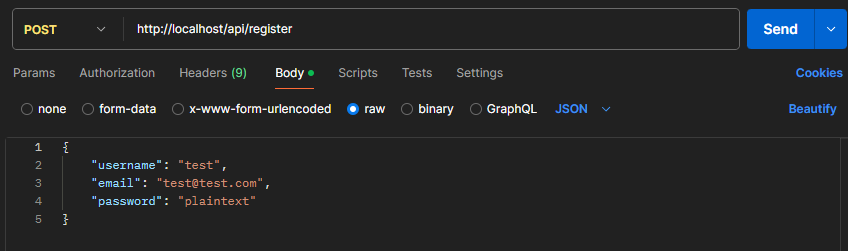

# FF site backend

The backend for the [Final Frontier site](https://vortox.space). This server is responsible for serving the site's static files and handling the API requests. The server is built using Node.js and Express.js.

The backend uses a PostgresQL database to store user data, such as user accounts and user-generated content such as characters, weapons, items, etc. We use the Prisma ORM to interact with the database.

## Table of Contents

-   [Installation](#installation)
-   [Usage](#usage)

## Installation

1. Clone this repository and run `npm install`.
2. Create a `.env` file in the root directory of the project and add the following environment variables:

```
POSTGRES_USER=vortox
POSTGRES_PASSWORD=password
POSTGRES_DB=final-frontier
```

Be sure to change the username, password, and database as you see fit.

There are now two separate methods for continuing the installation process: using Docker, or running locally.

### Docker

0. Run `sudo dockerd` to start the docker daemon if it is not already running.
1. Run `docker compose build --no-cache` to build the three docker containers: the node API container, the PostgresQL database container, and the NGINX proxy container.
2. Run `docker compose up` to run the docker containers.
3. Run the following two commands to generate the prisma client and fill the database schema:

```bash
docker exec ff_api npx prisma generate
docker exec ff_api npx prisma migrate dev --name init
```

4. You can now access the api through Postman or a similar HTTP request client through the address: "http://localhost/api/"



### Running Locally (Untested)

1. Set up a PostgresQL server (TODO: instructions on doing so)
2. Update your `.env` file with the following key value pair, substituting the values in curly braces with the values you added above:

```
DATABASE_URL=postgresql://{POSTGRES_USER}:{POSTGRES_PASSWORD}@db:5432/{POSTGRES_DB}?schema=public`
```

3. Run the following two commands to generate the prisma client and fill the database schema:

```bash
npx prisma generate
npx prisma dev --name init
```

4. You can now access the api through Postman or a similar HTTP request client through the address: "http://localhost:3000/"
